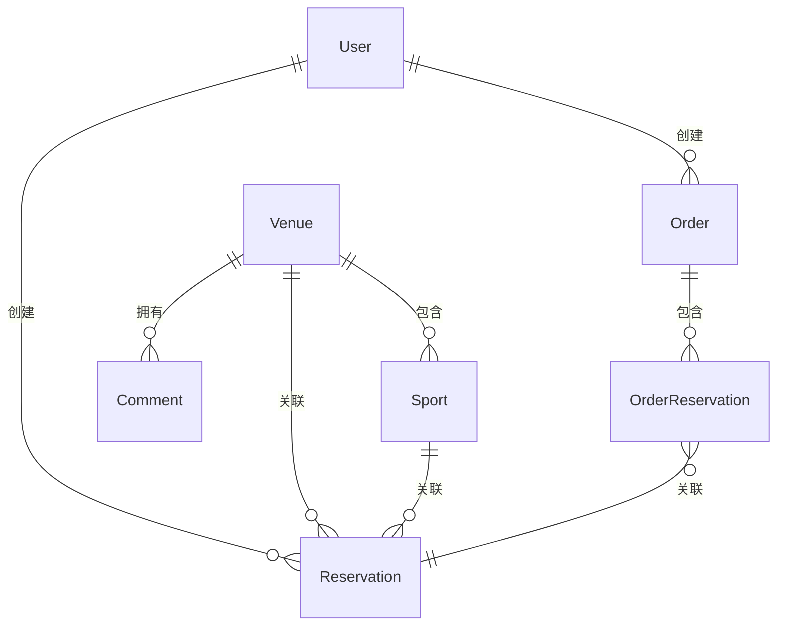

### 后端项目 API 接口文档

#### **项目概述**
本项目是一个基于 MidwayJS + TypeORM 的体育场馆预约系统，主要功能包括：
- 用户认证（学生/老师双角色）
- 场馆管理（创建/搜索/详情）
- 运动项目管理（按场馆分类）
- 预约报名（学生创建、老师审批）
- 订单管理（关联预约记录）
- 评论系统
- 个人中心

---

### **1. 用户模块（User）**
**认证方式**：Bearer Token（JWT）
**忽略鉴权路径**：`/user/register`, `/user/login`

| 接口路径 | 方法 | 描述 | 请求参数 | 角色限制 |
|----------|------|------|----------|----------|
| `/user/register` | POST | 用户注册 | `{ name, phone, password, role }` | 无 |
| `/user/login` | POST | 用户登录 | `{ phone, password }` | 无 |
| `/user/info` | GET | 获取当前用户信息 | 无 | 所有登录用户 |

---

### **2. 场馆模块（Venue）**
| 接口路径 | 方法 | 描述 | 请求参数 | 角色限制 |
|----------|------|------|----------|----------|
| `/venue/create` | POST | 创建场馆 | `{ name, description, address, phone }` | 老师 |
| `/venue/list` | GET | 获取所有场馆列表 | 无 | 所有登录用户 |
| `/venue/:vid` | GET | 获取场馆详情 | 路径参数：`vid` | 所有登录用户 |
| `/venue/update/:vid` | PUT | 更新场馆信息 | 路径参数：`vid` + Body 更新字段 | 老师 |
| `/venue/delete/:vid` | DELETE | 删除场馆 | 路径参数：`vid` | 老师 |

---

### **3. 运动项目模块（Sport）**
| 接口路径 | 方法 | 描述 | 请求参数 | 角色限制 |
|----------|------|------|----------|----------|
| `/sport/create` | POST | 创建运动项目 | `{ name, venueId }` | 老师 |
| `/sport/list` | GET | 按场馆获取运动项目 | 查询参数：`venueId` | 所有登录用户 |
| `/sport/delete` | DELETE | 删除运动项目 | 查询参数：`sid` | 老师 |

---

### **4. 预约模块（Reservation）**
| 接口路径 | 方法 | 描述 | 请求参数 | 角色限制 |
|----------|------|------|----------|----------|
| `/reservation/create` | POST | 创建预约报名 | `{ venueId, sportId, timeSlot }` | 学生 |
| `/reservation/list` | GET | 获取当前用户所有预约 | 无 | 学生 |
| `/reservation/delete` | DELETE | 删除预约 | 查询参数：`rid` | 学生（仅限未关联订单的预约） |

---

### **5. 订单模块（Order）**
| 接口路径 | 方法 | 描述 | 请求参数 | 角色限制 |
|----------|------|------|----------|----------|
| `/order/create` | POST | 创建订单（将待上传预约打包） | 无 | 学生 |
| `/order/list` | GET | 获取所有订单（含预约详情） | 无 | 老师 |
| `/order/approve` | POST | 审批订单 | `{ oid, approve }` | 老师 |

> **状态流转**：
> 预约状态：`待上传` → (`创建订单`) → `已上传` → (`审批通过`) → `已批准`

---

### **6. 评论模块（Comment）**
| 接口路径 | 方法 | 描述 | 请求参数 | 角色限制 |
|----------|------|------|----------|----------|
| `/comment/create` | POST | 添加评论 | `{ venueId, content }` | 所有登录用户 |
| `/comment/list` | GET | 获取场馆评论 | 查询参数：`venueId` | 所有登录用户 |

---

### **7. 活动模块（Activity）**
| 接口路径 | 方法 | 描述 | 请求参数 | 角色限制 |
|----------|------|------|----------|----------|
| `/activity/search` | GET | 搜索场馆（按名称/运动类型） | 查询参数：`keyword` | 所有登录用户 |
| `/activity/detail` | GET | 获取场馆详情（含评论） | 查询参数：`venueId` | 所有登录用户 |

---

### **8. 个人中心模块（Personal）**
| 接口路径 | 方法 | 描述 | 请求参数 | 角色限制 |
|----------|------|------|----------|----------|
| `/personal/update` | PUT | 更新个人信息 | Body 更新字段 | 所有登录用户 |
| `/personal/logout` | POST | 退出登录 | 无 | 所有登录用户 |

---

### **9. 其他接口**
| 接口路径 | 方法 | 描述 |
|----------|------|------|
| `/` | GET | 服务健康检查（返回 `Hello Midwayjs!`） |

---

### **数据库实体关系**


---

### **关键业务逻辑**
1. **订单创建**
   - 学生将状态为 `待上传` 的预约打包成订单
   - 自动更新关联预约状态为 `已上传`
2. **订单审批**
   - 老师审批订单（同意/拒绝）
   - 审批通过后，关联预约状态更新为 `已批准`
3. **预约删除限制**
   - 已关联到订单的预约不可删除

---

### **部署与开发命令**
```bash
# 启动生产环境
npm run start

# 启动开发模式（热更新）
npm run dev

# 数据库迁移
npm run typeorm:generate  # 生成迁移文件
npm run typeorm:run        # 执行迁移
```

> **环境配置**：
> - JWT 密钥：`config.default.ts` 中的 `jwt.secret`
> - 数据库连接：`data-source.ts` 和 `config.default.ts`

---

